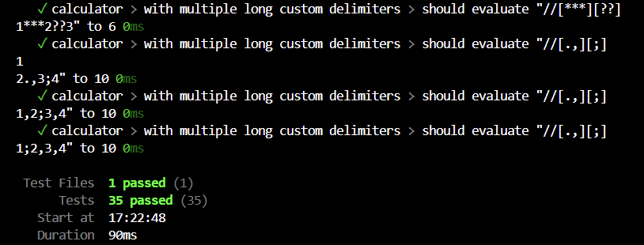

📐 String Calculator

    A simple String Calculator built in JavaScript with comprehensive test coverage using Vitest.

🧪 Method Signature

    int Add(string numbers)
    The add() method takes a string input containing zero or more numbers, separated by delimiters, and returns their sum.

✅ Features

    ✅ Basic Addition
        - An empty string returns 0.
        - A single number returns its value.
        - Two or more numbers return their sum.
        Examples:
        calculator.add("")         // 0
        calculator.add("2")        // 2
        calculator.add("1,2")      // 3

    ✅ Support for Unlimited Numbers
        Handles any number of values:
        calculator.add("1,2,3,4")  // 10

    ✅ Newline Delimiters
        Supports newline characters \n as separators:
        calculator.add("1\n2,3")   // 6

    ✅ Custom Delimiters
        Specify custom delimiters using this format:
        calculator.add("//;\n1;2") // 3

    ✅ Multiple Custom Delimiters
        Supports multiple delimiters, including those of any length:
        calculator.add("//[***]\n1***2***3")     // 6
        calculator.add("//[*][%]\n1*2%3")        // 6
        calculator.add("//[***][%%]\n1***2%%3")  // 6

    ✅ Negative Number Handling
        Throws an error listing all negative numbers:
        calculator.add("1,-2,-3") // ❌ Error: "negatives not allowed: -2, -3"

    ✅ Ignore Numbers Greater Than 1000
        Any number > 1000 is ignored:
        calculator.add("2,1001")    // 2
        calculator.add("1000,2000") // 1000

🔍 About Vitest

    Vitest is a fast unit test framework powered by Vite. It supports modern JavaScript, TypeScript, and ESM out of the box.

    Why Vitest?

    - ⚡ Fast startup and execution time
    - 🔄 Built-in watch mode for test re-runs
    - 📂 Snapshot testing support
    - ✅ Works seamlessly with Vite projects
    - 🧪 Great for testing frontend and logic-heavy JavaScript applications

🧪 Testing with Vitest

    Tests are located in tests/calculator.test.js and cover:
        - Basic input/output
        - Newlines and commas
        - Custom and multiple delimiters
        - Error handling for negatives
        - Ignoring numbers > 1000

📦 Run Tests

    npm install
    npx vitest or npm t

✅ Test Results

    All test cases were executed using Vitest, and passed successfully, covering:
    - Basic addition
    - Newline and custom delimiters
    - Negative number error handling
    - Ignoring numbers > 1000

    Below is a snapshot of the successful test run:

🚀 How to Use

    1. Clone the repo
    2. Import and call calculator.add() in your JavaScript code
    3. Modify or expand test cases as needed

📂 Project Structure

    STRING_CALCULATOR_TDD_KATA
    ├── assets/
    │   ├── test-results-1.png
    │   ├── test-results-2.png
    │   ├── test-results-3.png
    │   └── test-results-5.png
    │
    ├── src/
    │   └── calculator.js
    │
    ├── tests/
    │   └── calculator.test.js
    │
    ├── package.json
    ├── package-lock.json
    └── README.md

🛠️ Tech Stack

    - JavaScript (ES6)
    - Vitest (unit testing framework)

📌 Notes

    - Delimiters of any length are supported via //[delim]
    - Multiple delimiters are supported via //[delim1][delim2]
    - Only numeric values up to 1000 are summed
    - Negative numbers throw a custom error message
   
